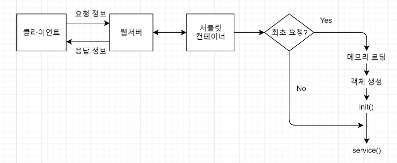
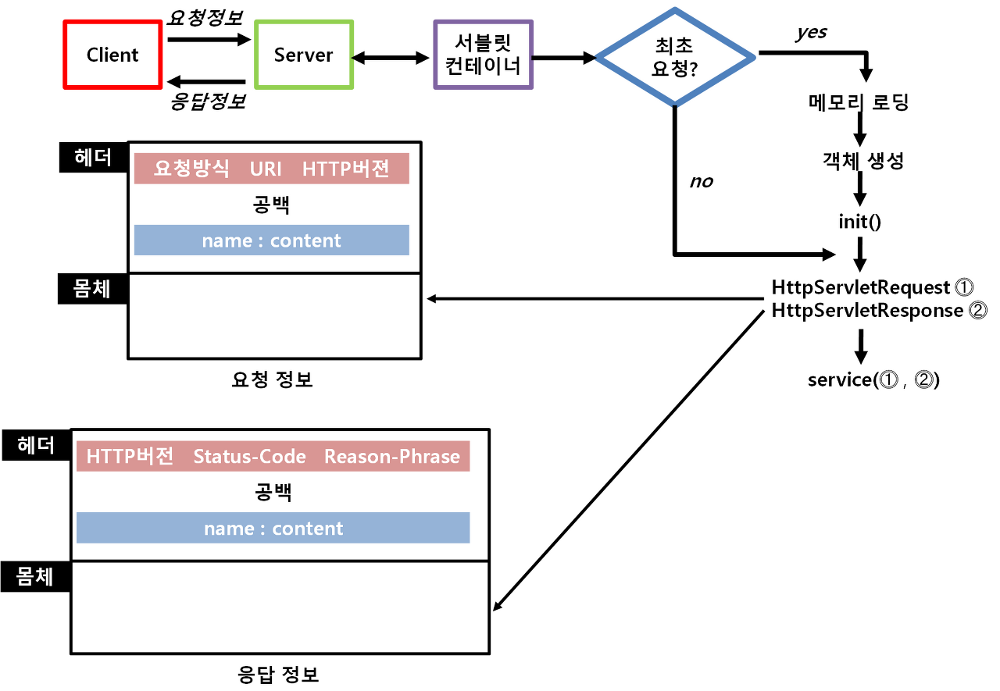

# Servlet
## List
* [웹(WEB)](#WEB)
    * [Java SE](#Java-SE)
    * [서블릿(Servlet)](#서블릿(Servlet))
    * [JSP](#JSP)
    * [웹 서비스](#웹-서비스)
    * [웹 서버와 웹 애플리케이션 서버](#웹-서버와-웹-애플리케이션-서버)
    * [컨테이너](#컨테이너)
    * [HTTP란?](#HTTP란?)
    * [HTTP 요청방식](#HTTP-요청방식)
    * [요청 URI](#요청-URI)
* [서블릿(SEVLET)](#SERVLET)
    * [Http Servlet](#Http-Servlet)
    * [콜백 메소드(Callback method)](#콜백-메소드)
    * [web.xml](#web.xml)
    * [@WebServlet](#@WebServlet)
* [요청정보와 응답정보](#요청정보와-응답정보)
    * [객체 생성 및 삭제](#객체-생성-및-삭제)
## WEB
### Java SE
* JDK(Java Development Kit)
    * 자바 개발 환경으로서 Java Virtual Machine(JVM)과 컴파일러, 디버거 및 애플리케이션 개발을 위한 도구들이 포함되어 있음.
* JRE(Java Runtime Environment)
    * 자바 애플리케이션 개발 도구인 JDK의 일부로서, 자바 애플리케이션이 실행되는 데 필요한 최소한의 요건을 제공하며, JVM과 핵심적인 클래스들 그리고 각종 지원 파일들로 구성됨.

### 서블릿(Servlet)
* 자바 언어로 구현되는 서버 프로그램
* 클라이언트가 웹 브라우저를 통해 요청하면 서버에서 실행한 후 결과값만 클라이언트로 전송.
* HTTP 프로토콜로 통신하는 웹의 특징과 속성들을 자유롭게 활용할 수 있는 API를 제공함으로써, 클라이언트의 요청과 서버의 응답에 관한 처리 작업을 쉽게 할 수 있음.
* 기존의 CGI(Common Gateway Interface)가 가지던 성능적인 약점, 메모리 문제, 단일 인스턴스로 인한 병목현상 등을 해결함으로써 자바의 사용점유율을 높임.
* 기업의 시스템 구조가 메인 프레임 기반에서 유닉스 기반의 오픈 환경으로 변화하는데 기여.

### JSP
* 서블릿과 똑같은 기능을 가지나 표현하는 방법과 웹 애플리케이션에서의 역할이 다름.
* 서블릿은 완벽하게 자바 언어로 구현해야 하지만, JSP는 HTML 페이지 안에서 스크립트 형태로 구현됨.
* 서블릿은 컨트롤러(Controller) 페이지를 만들 때 사용하지만, JSP는 뷰(View) 페이지를 만들 때 사용함.

### 웹 서비스
* 네트워크상에 분산된 자원들을 이기종 간에 서로 연동하여 자원을 공유하기 위한 추상적인 서비스 형태를 의미.
* SOAP 기반 웹 서비스와 RESTful기반 웹 서비스가 있음.
    * SOAP 기반 웹 서비스
        * SOA(Service Oriented Architecture) 개념을 실현하기 위한 대표적인 기술.
        * 서비스 제공자가 공유 혹은 서비스하려는 자원을 UDDI라는 전역 서비스 저장소에 등록(publish)하여 공개하면, 서비스 요청자가 검색한 후 서비스 제공자와 HTTP의 응용 프로토콜인 SOAP를 이용하여 메시지를 주고받는 방식.
        * 서비스 제공자와 요청자가 주고받는 SOAP 메시지는 SOAP 봉투(envelope), SOAP 헤더와 SOAP 몸체로 구성된 하나의 XML 문서로 표현 -> HTTP로 전달되므로 크기가 크며, 송수신 시 헤더와 몸체를 인코딩/디코딩해야 하는 작업을 거쳐야 함.
    * RESTful 기반 웹 서비스
        * ROA(Resource Oriented Architecture) 개념을 실현하기 위한 리소스 중심의 표현, 전달, 접근 방식의 기술
        * SOAP 기반 웹 서비스의 문제점인 오버헤드 발생, 메시지의 인코딩/디코딩의 어려움을 보완할 수 있음.
        * REST(Representational State Transfer)기반의 웹 서비스로서, HTTP의 기본 기능만으로 원격 정보에 접근할 수 있음.
        * 상호 연동을 위한 서비스를 등록하기 위한 저장소가 필요하지 않으며, 단순히 서버와 클라이언트로만 분리되어 있음.
        * 리소스 접근을 위해 단순 URI로 표현하며, HTTP의 요청방식인 GET, POST, PUT, DELETE만으로 접근할 수 있음.
        * 클라이언트에서 XML, JSON, HTML, TEXT, IMAGE 등 원하는 형식으로 표현할 수 있음.

### 웹 서버와 웹 애플리케이션 서버
* 웹서버
    * 웹에서 서버 기능을 수행하는 프로그램
    * HTTP라는 프로토콜을 기반으로 하여 웹 클라이언트(브라우저)로부터의 요청을 서비스하는 기능을 담당.
    * 클라이언트로부터의 요청을 받는 일과 처리된(서비스) 결과를 클라이언트로 응답하는 일을 함.
        1. 클라이언트가 요청한 웹 문서를 찾아서 전달하는 기능을 처리.
        2. 요청 파일이 없거나 문제가 발생하면 정해진 코드 값으로 응답.
        3. 클라이언트로부터의 요청에 대한 기본 사용자 인증(Basic Authentication)을 처리.
        4. 서버 프로그램에 대한 요청을 웹 애플리케이션 서버에 수행시키고 그 결과를 응답.
* 웹 애플리케이션 서버(WAS)
    * 웹 서버의 기능을 분리해서 처리하려는 목적으로 웹 애플리케이션 서버(Web Application Server)를 사용.
    * 클라이언트로부터 요청받은 일과 화면에 표현하는 로직(Presentation Logic)까지만 웹서버에서 담당하고, 다양한 기능을 수행하는 로직(Business Logic)은 컨테이너가 담당하도록 WAS에서 일을 나누어 역할을 분담.
    * 웹서버 기능과 컨테이너 기능으로 구성됨.
    * Java EE 기술을 지원하는 서버로서 웹서버 기능에 서블릿/JSP 컨테이너 그리고 EJB 컨테이너 기능까지 지원하는 서버를 제공.
    * 웹로직, 웹스피어, 제우스, 제이보스, 톰캣 등이 있음.

### 컨테이너
* 웹 컴포넌트를 저장하는 저장소 역할, 메모리 로딩, 객체 생성 및 초기화 등 서블릿의 생명주기를 관리하고 JSP를 서블릿으로 변환하는 기능을 수행하는 프로그램.
    * 서블릿 컨테이너
        * 클라이언트의 요청에 따라 서블릿을 수행하는 프로그램.
        * 자바 수행 환경, 웹 서버, 서블릿 컨테이너 환경을 구성해야 함.
    * JSP 컨테이너
        * JSP를 서블릿으로 변환하는 프로그램.
        * 서블릿으로 구현되었음.
        * JSP 파일을 서블릿 소스로 변환 및 컴파일까지만 담당함.
        * 자바 수행 환경, 웹 서버, 서블릿 컨테이너, JSP 컨테이너 환경을 구성해야 함.
* 대부분 WAS에서는 서블릿 컨테이너와 JSP 컨테이너를 내장하고 있음.

### HTTP란?
* HTTP(Hyper Text Transfer Protocol)는 TCP/IP 4계층에서 애플리케이션 계층(Application Layer)에 해당하는 프로토콜로서, 전송 계층(Transport Layer)에서 TCP를 사용하여 웹 브라우저와 웹 서버 간에 통신하는 프로토콜.
* 웹 브라우저와 웹서버가 통신(요청, 응답)할 때 서로 약속된 요청, 응답 메시지를 주고받으면서 통신이 이루어짐.
* HTTP 특징
    * 무연결(Connectionless) : 연결을 유지하지 않은 상태로 데이터를 주고 받을 수 있음.
    * 무상태(Stateless) : 요청마다 서로 다른 연결로 인식되어 요청 간에 정보를 공유해서 사용할 수 없는 상태, 즉 상태정보가 유지되지 않는 특성.
    * 요청·응답(Request·Response) : 클라이언트가 서비스를 요청하면 서버는 요청 정보를 받ㄷ고 요청을 처리한 후 응답함으로써 서비스가 완료되는 방식.

### HTTP 요청방식
* GET
    * 웹 브라우저의 주소 줄에 URL을 직접 입력하거나 하이퍼링크가 포함된 개체를 클릭할 때, 또는 직접 GET 방식을 지정하여 서비스를 요청할 때 사용.
    * 브라우저에서 캐시(Cache)가 가능하며 클라이언트가 서버로 전송하는 문자열이 있을 때는 요청정보 헤더의 요청 줄에 포함되는 URI 뒤에 ? 기호와 함께 추가되어 전달.
    * 모든 문자열 정보들이 웹 브라우저에 노출되는 특징이 있으며, 헤더에 포함되므로 전달되는 문자열의 크기에 제한이 있음.
    * 서버에 빠른 속도로 요청할 때 사용.
* POST
    * 데이터가 HTTP 요청정보의 몸체에 포함되어 전달.
    * 데이터 크기에 제한이 없고, 화면에 노출되지 않음.
    * 웹 클라이언트 측에서 보내는 데이터를 인코딩하고, 서버 측에서 디코딩해야 하므로 GET 방식보다 상대적으로 처리속도가 느림.
    * 서버 측의 정보를 새로 생성하는 작업에 사용.
* PUT
    * 파일 업로드를 할 때 이용.
    * 일반적으로 서버의 리소스를 새로 생성할 때는 POST 방식으로 요청하고 서버의 리소스를 수정할 때는 PUT 방식으로 구분하여 요청
* DELETE
    * 서버의 리소스를 삭제하는 작업을 요청할 때 사용.

### 요청 URI
* 웹 클라이언트가 웹서버에 요청한 서비스 문서의 정보.
* 네트워크의 자원 정보인 URL의 일부로서 URL(Uniform Resource Locator)은 네트워크상에 존재하는 자원을 찾아가기 위한 정보.
* URI 형식
    * 프로토콜(protocol)ㅉ
        * 서버와 통신하기 위한 규약으로서 서버마다 사용하는 프로토콜이 정해져 있음.
        * ex) 웹서버는 HTTP:// 오라클 DBMS jdbc:oracle:thin:@
    * 서버 주소
        * 네트워크상에서 연결된 컴퓨터를 찾아가기 위한 정보로서 IP 주소 또는 도메인 이름으로 표현
    * 포트 번호
        * 컴퓨터에서 동작하고 있는 서버로 접속하기 위한 정보.
        * 0~65,535번까지 사용할 수 있으며, 0~1,023 사이의 번호는 well-known port로서 이미 사용이 정의되어 있음.
    * URI
        * 서버에서 서비스하는 서버의 자원 정보.
        * URL에서 포트 번호 다음부터 URI이다.

### HTTP 상태코드
* 200 OK
    * 클라이언트의 요청을 성공적으로 처리했음을 나타내며, 서버는 요청한 데이터를 포함하여 응답.
* 400 Bad Request
    * 클라이언트의 요청에 문법적인 오류 등 잘못된 요청으로 서버가 요청을 해석할 수 없는 경우.
    * 이런 경우는 잘못된 요청 형식을 수정하여 다시 요청.
* 401  Unauthorized
    * 인증 오류(Unauthorized)로서 클라이언트가 잘못된 인증 정보를 Authorization 헤더에 넣었음을 나타냄.
    * 이런 경우 클라이언트는 요청정보 헤더의 Authorization에 적절한 인증 정보를 설정한 후 다시 요청해야 함.
* 403 Forbidden
    * 사용자 허가 모드 오류(Forbidden)로서 클라이언트의 인증 정보에 상관없이 페이지에 대한 접근을 거부한다는 것은 나타냄.
* 404 Not Found
    * 클라이언트가 요청한 문서가 존재하지 않음을 의미.
    * 클라이언트의 요청에 대하여 서비스하는 요청 URI를 서버가 찾지 못한 경우.
* 405 Method Not Allowed
    * 클라이언트가 요청한 서비스 요청방식을 웹서버에서 지원하지 않음을 의미.
    * 이런 경우는 요청한 서비스 요청방식을 확인한 후 서버 프로그램에서 해당 요청방식 처리 메소드가 구현되었는지를 확인.
* 500 Internal Server Error
    * 서버 프로그램 실행 시 오류가 발생하여 서버 프로그램이 실행을 멈추었거나 올바르지 않은 응답 헤더 정보가 설정되었을 때 발생함.
    * 일반적으로 서버 프로그램 실행 오류가 많으며, 이런 경우 서버 프로그램 내에서 구현의 오류를 찾아 수정해야 함.

## SERVLET
### Http Servlet
* GenericServlet 클래스를 상속하여 service() 메소드를 재정의함으로써 HTTP 프로토콜에 알맞은 동작을 수행하도록 구현한 클래스.
* HTTP 프로토콜 기반으로 브라우저로부터 요청을 전달받아서 처리하도록 하는 클래스.
* service() 메소드에는 요청방식(GET 또는 POST)에 따라 doGet(), doPost() 등 정해진 사양의 메소드가 호출되도록 구현.
* 어떠한 요청방식을 지원하는 서블릿인지에 따라서 필요한 메소드를 재정의하여 구현하며 반드시 재정의해야 하는 메소드는 없다.

### 서블릿 실행 순서

1. 클라이언트로부터 처리 요청 받음
* 클라이언트가 웹 브라우저를 통해 요청을 보내면 웹서버는 이를 받아서 요청정보의 헤더안에 있는 URI를 분석.
* 요청받은 페이지가 서블릿이면 서블릿 컨테이너에 처리를 넘김.
* 서블릿 컨테이너는 요청받은 서블릿을 WEB-INF/classes나 WEB-INF/lib에서 찾아서 실행준비를 함.
2. 최초의 요청 여부 판단
* 서블릿 컨테이너는 현재 실행한 섭르릿이 최초의 요청인지를 판단.
* 실행할 서블릿 객체가 메모리에 없으면 최초의 요청이고, 이미 있으면 최초의 요청이 아닌 것으로 판단.
* 최초의 요청은 말 그대로 처음 요청할 때 딱 한 번만 실행.
3. 서블릿 객체 생성
* 서블릿 컨테이너는 요청받은 서블릿이 최초의 요청이라면 해당 서블릿을 메모리에 로딩하고 객체를 생성.
* 일반 자바 객체는 new 명령문으로 여러 개의 객체를 언제든지 직접 생성할 수 있지만, 서플릿은 최초 요청이 들어왔을 때 한 번만 객체를 생성하고 이때 생성된 객체를 계속 사용함.
4. init() 메소드 실행
* init()는 서블릿 객체가 생성된 다음에 호출되는 메소드로서, Servlet 인터페이스에 선언되어 있고, 기능은 GenericServlet 클래스에 구현되어 있음.
* init() 메소드는 처음 요청 시 서블릿 객체가 생성된 다음 호출되므로 주로 서블릿 객체의 초기화 작업이 구현되어 있음.
* GenericServlet 클래스에 구현된 내용을 바꾸고 싶다면 init() 메소드를 재정의하여 원하는 내용으로 변경하면 됨.
5. service() 메소드 실행
* service() 메소드는 실행하는 서블릿의 요청 순서에 상관없이 클라이언트의 요청이 있을 때마다 실행.
* service() 메소드에는 실제 서블릿에서 처리해야 하는 내용이 구현되어 있음.
* service() 메소드는 Servlet 인터페이스에 선언되어 있고, GenericServlet 클래스에 abstract 메소드로 선언되어 있으므로, HttpServlet 클래스에 메소드 몸체가 구현되어 있음.
* HttpServlet 클래스에 구현된 내용을 변경하고 싶다면 service()메소드를 재정의하여 원하는 내용으로 변경하면 됨.

### 콜백 메소드
* 콜백 메소드(callback method)
    * 어떤 객체에서 어떤 상황이 발생하면 컨테이너가 자동으로 호출하여 실행되는 메소드를 의미.
    * HttpServlet 클래스를 상속받은 다음 재정의한 init(), service()가 콜백 메소드에 속함.
    * GenericServlet 클래스에 선언되어 있는 destroy() 메소드는 메모리에서 서블릿 객체가 삭제될 때 호출되는 콜백 메소드.

### web.xml
* \<servlet>
    * HttpServlet을 상속받고 있는 클래스를 web.xml에 등록할 때 사용.
    * 반드시 하위에 \<servlet-name>과 \<servlet-class> 태그를 가져야 함.
* \<servlet-name>
    * 등록하는 서블릿의 이름을 부여함.
    * 실제 존재하는 이름이 아닌 개발자가 지정하는 이름.
    * \<servlet-name> 등록 후에는 서블릿 클래스 이름이 아닌 등록된 서블릿 이름으로 사용해야 올바르게 작동함.
* \<servlet-class>
    * 등록하는 서블릿의 실제 클래스 이름을 지정.
    * \<servlet-class>에 지정된 정보로 웹서버가 서블릿 객체를 찾아 올바르게 서블릿에 관한 설정을 할 수 있음.
    * \<servlet-class> 정보는 웹서버가 서블릿을 찾아갈 때 사용하는 정보로서 패키지명과 함께 대소문자를 구분하여 정확하게 이름을 지정해야 함.
* \<servlet-mapping>
    * web.xml에서 \<servlet> 태그로 등록한 서블릿을 실행 요청할 때 사용할 URI을 지정하기 위해 사용.
    * \<servlet> 태그를 사용했을 때만 부가적으로 사용할 수 있고, \<servlet>으로 등록된 서블릿이 아니면 사용할 수 없음.
* \<servlet-name>
    * 실행할 서블릿 이름을 지정.
    * 지정하는 이름은 반드시 \<servlet> 태그에서 등록한 서블릿 이름으로 지정.
    * \<servlet> 태그에서 등록하지 않은 이름으로 설정하면 web.xml 오류가 발생하여 웹 애플리케이션 서비스가 웹서버에 올라가지 않음.
    * 이 정보를 가지고 \<servlet> 태그를 찾아 매핑한 다음 실제 서블릿 클래스와 연결됨.
* \<url-pattern>
    * 서블릿을 실행할 때 사용할 URL을 지정함.
    * 'http://서버주소:포트번호/웹 애플리케이션이름'까지는 생략하고, 그 다음부터만 지정하면 됨.
    * 경로를 지정할 때는 /를 구분자로 하여 개발자 마음대로 정하면 됨.
    * \<url-pattern> 태그에 경로를 지정하면 이다음부터는 지정된 경로로 접근하면 서블릿이 실행됨.

### @WebServlet
* web.xml 설정파일 없이 자바 소스에서 @WebServlet 으로 쉽게 URL 패턴을 지정하는 방법.
* @WebServlet 설정을 통한 서블릿 접ㅈ근방법은 서블릿3.0부터 지원함.
* 서블릿의 클래스 선언부 앞에 @WebServlet(접근 시 사용할 URI)를 지정.
* import 문으로 javax.servlet.annotation.WebServlet 클래스를 소스에 포함해야 함.

## 요청정보와 응답정보
### 객체 생성 및 삭제
* 요청정보는 HttpServletRequest를 처리하고, 응답정보는 HttpServletResponse가 처리함.

1. 클라이언트가 웹 브라우저에서 서비스를 요청함. 이때 HTTP 프로토콜 기반으로 요청정보가 만들어져 웹서버에 전달됨.
2. 웹서버는 클라이언트로부터 전달받은 요청정보의 URI를 살펴보고, 서블릿이라면 서블릿 컨테이너에 처리를 넘김.
3. 서블릿 컨테이너는 요청받은 서블릿 클래스 파일을 찾아서 실행함.
4. 실행할 때 첫 순서는 최초의 요청인지를 파악함. 최초의 요청이라면 메모리에 로딩 후 객체를 생성하고 init() 메소드를 호출함.
5. init() 메소드 실행이 끝난 다음에는 최초의 요청이든지 그렇지 않든지 서블릿 실행 요청이 들어올 때마다 실행되는 작업으로, 서블릿 컨테이너는HttpServletRequest와 HttpServletResponse 객체를 생성함. HttpServletRequest 객체는 클라이언트로부터 요청받은 정보를 처리할 목적으로 생성하고, HttpServletResponse 객체는 클라이언트에게 보내는 응답정보를 처리할 목적으로 생성함.
6. service() 메소드를 호출함. 이때, 앞에서 생성한 HttpServletRequest와 HttpServletResponse 객체의 주소를 인자로 넘김. service() 메소드에서는 인자로 받은 두 객체를 사용하여 프로그램을 구현함.
7. service() 메소드가 완료되면 클라이언트에게 응답을 보내고 서버에서 실행되는 프로그램은 완료됨. 이때, HttpServletRequest와 HttpServletResponse 객체는 소멸함.
* HttpServletRequest와 HttpServletResponse 객체는 service()메소드가 실행되기 전에 생성되었다가 끝나면 소멸함.

### HTTP 요청정보